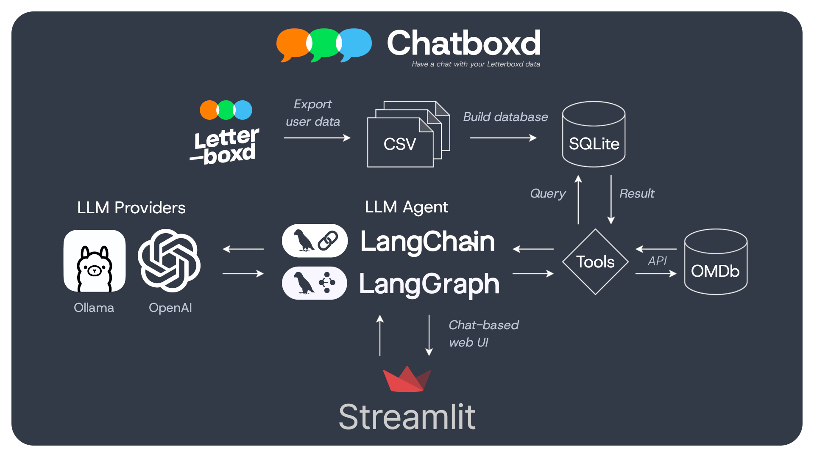

Chatboxd lets you chat with the diary and reviews exported from your Letterboxd account. The API is FastAPI. The UI is a React app. The agent still runs on LangChain and LangGraph.

It supports several languages and several LLM providers (OpenAI, Google Gemini, and Ollama).

## Contents

1. [Run the app](#run-the-app)
    - [Install tools](#install-tools)
    - [Set API keys](#set-api-keys)
    - [Load Letterboxd data](#load-letterboxd-data)
    - [Start the API and the UI](#start-the-api-and-the-ui)
2. [How it works](#how-it-works)
    - [Agent](#agent)
    - [Tools](#tools)
    - [Database](#database)

## Run the app

### Install tools

Install [uv](https://docs.astral.sh/uv/getting-started/installation/) and Node.js 20 or newer.

```bash
curl -LsSf https://astral.sh/uv/install.sh | sh
```

### Set API keys

Copy `backend/template_secrets.env` to `backend/secrets.env` and fill in the keys you use.

```
OPENAI_API_KEY=
GOOGLE_API_KEY=
```

You can also export the same variables in your shell. Add `OMDB_API_KEY` if you want the extended movie-detail tool.

### Load Letterboxd data

You can upload `diary.csv` and `reviews.csv` in the app. To load them from the command line instead:

1. Export your data from [Letterboxd data settings](https://letterboxd.com/settings/data/).
2. Put `reviews.csv` and `diary.csv` in `backend/src/data_ingestion/user_data/`.
3. Set `USER_NAME` in `backend/src/data_ingestion/main.py` if you share one database across people.
4. Run:

```bash
cd backend
PYTHONPATH=src uv run python src/data_ingestion/main.py
```

The script creates `reviews` and `diary` in `backend/letterboxd.db`. Diary rows link to reviews when the movie name and date match.

`reviews.csv` needs `Date`, `Name`, and `Review`.

`diary.csv` needs `Date`, `Name`, `Year`, `Letterboxd URI`, `Rating`, `Rewatch`, `Tags`, and `Watched Date`.

### Start the API and the UI

In one terminal:

```bash
cd backend
uv run uvicorn api.app:app --app-dir src --reload --port 8000
```

In another:

```bash
cd frontend
npm install
npm run dev
```

Open the URL Vite prints, usually `http://localhost:5173`. The first `uv run` in `backend/` creates the virtualenv and installs Python packages.

## How it works

The LLM is orchestrated with [LangChain](https://www.langchain.com/) and [LangGraph](https://www.langchain.com/langgraph), and served through OpenAI, Gemini, or [Ollama](https://www.ollama.com/). Watches and reviews live in SQLite. FastAPI streams agent events to the React UI.



### Agent

The graph is a ReAct loop with a history filter in front.

- `act`. The model calls tools.
- `observe`. Tool output goes back to the model.
- `reason`. The model decides whether to call another tool or answer.


The `Filter` node drops old turns so the prompt stays bounded.

Chat tokens, tool status, movie cards, and rating histograms travel as SSE events on `POST /api/chat`.

### Tools

- `get_movies`. Filter the diary by title, dates, rating, year, or rewatch.
- `get_reviews`. Find reviews by movie name or review id.
- `get_graph`. Build rating-distribution data for the UI chart.
- `get_movie_details`. Scrape Letterboxd Open Graph data from a film URL.
- `get_movie_details_extended`. Same, plus OMDb plot and ratings when `OMDB_API_KEY` is set.

### Database


